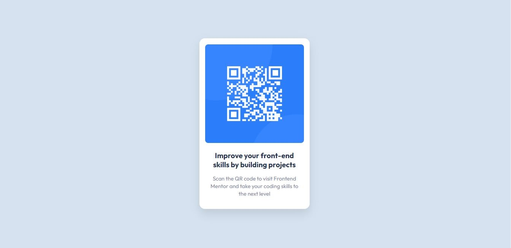

# Frontend Mentor - QR code component solution

This is a solution to the [QR code component challenge on Frontend Mentor](https://www.frontendmentor.io/challenges/qr-code-component-iux_sIO_H). Frontend Mentor challenges help you improve your coding skills by building realistic projects. 

## Table of contents

- [Overview](#overview)
  - [Screenshot](#screenshot)
  - [Links](#links)
- [My process](#my-process)
  - [Built with](#built-with)
  - [What I learned](#what-i-learned)
  - [Continued development](#continued-development)
- [Author](#author)


## Overview
Qr code component  based ui design

### Screenshot



### Links

- Solution URL: [Add solution URL here](https://github.com/purna-dev/QR-code-component)
- Live Site URL: [Add live site URL here](https://purna-dev.github.io/QR-code-component/)

## My process
First Code the skeleton of the page and css to style the page after that i properly align the items

### Built with

- Semantic HTML5 markup
- CSS custom properties
- Flexbox

### What I learned

How to use flexbox to develop this UI 
My code snippets :

```html
<div class="container">
    <div class="card">
      <div class="img_c">
        
      </div>

      <div class="card_text">
        <p>
          Improve your front-end skills by building projects
        </p>
        <span>

          Scan the QR code to visit Frontend Mentor and take your coding skills to the next level
        </span>
      </div>

    </div>
  </div>
```
```css

.container {
    display: flex;
    justify-content: center;
    align-items: center;
    height: 100vh;

}

.card {
    width: 290px;
    height: 450px;
    background-color: var(--White);
    box-shadow: var(--new-box-shadow);
    border-radius: 0.9em;
}

.img_c {
    display: flex;
    justify-content: center;
}

.card img {
    margin: 1em;
    width: 260px;
    border-radius: 0.5em;

}
.card_text{

    text-align: center;
    padding: 0 1.1em;
    
}
.card_text p{
    padding: 0.3em;
    margin-bottom: 0.4em;
     font-weight: 700;
    font-size: 1.2em;
}
.card_text span{
    
    font-size: 0.9em;
    color: var(--Grayish-blue);
}
```


### Continued development

flexbox
grid layout


## Author

- Website - [Purna Chandra Saren](https://purnachandra.me/)
- Frontend Mentor - [@purna-dev](https://www.frontendmentor.io/profile/purna-dev)
- Linkedin - [@yourusername](https://www.linkedin.com/in/impurna/)


